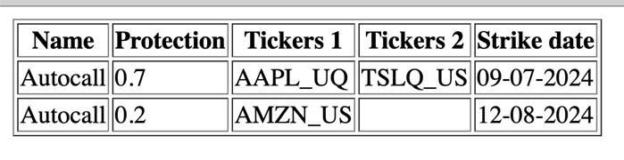

# 🍃 TestFramework

This is concept of my custom designed framework for test project of **Vizibility** company.

#### Why i choose that?

I chose this idea because it shows small solutions to problems, such as universal serialization of models*.

#### 📋 Table generator

Can convert list of maps to HTML table, example:

### 🔧 Requirement

- Any java with **JRE 20** support

#### ⚠️ This is didnt show production ready setup.

Why? Because this didn't logic, only basic structure, JDBC not configured, reflections didn't optimised. And need add
dependency injection module.

### [Original tasks](task.md)

*__model__ - DTO